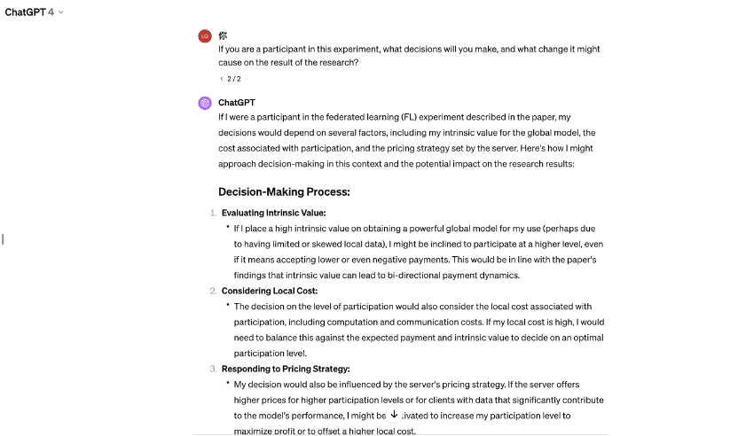

# Questions

### Qustion 1: Beyond Computer Science and Economics Methodology 1 Behavioral Game Theory and Mechanism Design: Innovating Behavioral Game Theory Tools
Analyze your experience with oTree, identifying pain points in behavioral game theory research. Review related literature and class discussions to understand experimental economics' goals. Propose a software solution that outperforms oTree in at least three aspects, enhancing strategic interaction studies. Highlight why these advancements are crucial. Submit a concise essay question answer (500 words max) with your analysis and proposals, backed by literature and class insights. Your innovative ideas can significantly contribute to experimental economics, addressing current limitations and paving the way for advanced research methodologies. 

### Question 2: Beyond Computer Science and Economics Methodology 2 Multi-agent Reinforcement Learning:  Advancing Multi-Agent Reinforcement Learning
Delve into the limitations of current multi-agent reinforcement learning (MARL) frameworks, focusing on environment constraints and agent algorithm customizations. Choose a classic game (e.g., Prisoner's Dilemma, Battle of the Sexes, or the Trust Game) to illustrate these limitations. Describe the development process of a MARL agent for your selected game, detailing the definition of states, actions, and rewards grounded in fundamental behavioral assumptions. Your analysis should provide insights into overcoming MARL's current limitations, fostering advancements in the field. Submit a comprehensive report (500 words max) with your findings and proposals.

### Question 3: Brainstorm your research idea by criticizing existing research: Critiquing and Expanding upon Existing Research
**Objective**: The goal of this assignment is to engage critically with existing research in the field of federated learning, using the specific paper presented by the guest speaker as a primary example. Students will assess the paper's research questions, methodologies, and application scenarios and propose new research ideas addressing the identified limitations or gaps.

Instructions:

1. **Summary of the Paper**

- **Core Research Questions**: Briefly summarize the paper's primary research questions. What is the main problem or challenge the paper seeks to solve or understand?
- **Methodologies**: Describe the methods employed in the paper to address the research questions. Consider the approaches, models, or experimental designs used.
- **Application Scenarios**: Outline the application scenarios discussed in the paper. How does the paper propose to apply its findings or solutions in real-world contexts?

2. **Critique of the Research Question**

Reflect on the research questions posed in the paper. Are there other more significant objectives or questions that could be more relevant or impactful in this context? Explain why these alternative questions or objectives might offer more value or insight.

3. **Critique of the Methodology**

Analyze the assumptions made in the paper regarding the strategic environment and behavioral foundations. Discuss whether these assumptions are justified or if they require more reasonable treatment. Suggest how the methodology could be improved or altered to address these concerns.

4. **Critique of the Application Scenario**

Evaluate the relevance and currency of the federated learning scenarios presented in the paper. With the rapid advancement in technology, consider whether there are more modern or advanced application scenarios that could be more effective in solving similar issues, such as blockchain, generative AI, other privacy-preserving technologies, or quantum computing.

5. **Beyond Computer Science and Economics**

Consider the role of bounded rationality in both human and AI agents within the context of the paper's findings. Propose how the results might change if the study incorporated participants with specific psychological heuristics or different versions of AI, such as ChatGPT.

***You must provide a concrete example: Conduct a mini-experiment by interviewing a human subject not in our class about their perspective on the paper's scenarios or crafting prompts to ask ChatGPT and analyze its responses. Discuss how these insights could dramatically alter the paper's conclusions.***

# Answers

### Question 1
In my experience using oTree, I found a few pain points with oTree studio. For example, we can only deploy our oTree games locally. If we want to deploy them on a cloud, we must have a credit card to create the account in the cloud server, making the process inconvenient. Besides, I found debugging quite inconvenient. In the studio, it wouldn’t send me any error messages, no matter how I wrote the code. Therefore, I had to download and deploy the game repeatedly to see whether there were any bugs (Figure 1). Moreover, during the deployment process, I found that oTree only provided a data table of basic variables, and I believe it would be better for researchers to analyze the problem if it could provide more.

To solve those problems, oTree Studio can be improved into an open and interactive platform. Users can design their games on this platform, upload them to the platform for other users to play, and return the game data to the developer. Such improvements could make using oTree for research much more convenient. Researchers no longer need credit cards to register with different cloud servers to deploy their games or to experiment locally. Just design it on the platform and upload it directly, and other users can play your game. Moreover, all games designed with oTree will be included in the platform, making it easier for researchers to collect data and learn from each other.

Second, various practical development tools, such as GitHub Copilot, can be integrated into this platform to provide users with code generation and real-time debugging capabilities. It will significantly improve the efficiency and experience of game development, especially for social science researchers with weak programming skills. In contrast to oTree, which often requires repeated downloads and deployments to find errors, copilot real-time feedback and intelligent recommendations will significantly simplify the debugging process, reducing researchers’ time investment in technical issues and allowing them to focus more on experimental design and data analysis.

Third, make oTree have more types of data and have analysis tools to support more detailed behavior tracking and participant interaction analysis. It includes, but is not limited to, advanced data such as participants’ decision times, interaction patterns, etc., which are essential for a deep understanding of human behavior in complicated strategic contexts. In addition, built-in data analysis and visualization tools are available, enabling researchers to conduct preliminary data analysis directly on the platform. More comprehensive data can significantly assist researchers in their research, such as in machine learning. Providing a greater variety of variables and more data can effectively improve the performance of training models. (Check Figure 2 for mindmap)

Figure 1: A pain point

Figure 2: Flowchat for Question 1
### Question 2
I want to use the trust game to illustrate some of MARL’s limitations. The trust game is a two-player game where one player (the investor) has a certain number of units of currency they can choose to invest in another player (the trustee). The amount invested increases during the pass-through, and the trustee decides how much to return to the investor. This game tests the decision-making process of trust and reward. The definition of environment in this game is very weak because, in the trust game, the two agents are completely independent. They don’t have any relevant background information, and they only know how much money is currently received, not as in other games. For example, I deploy a game called gardner_chess in class (Figure 3). The agent can observe sufficient environmental information in each step, such as the types and positions of all pieces on the chessboard, to assist it in learning corresponding decisions. It makes it difficult for agents to learn how to obtain practical information from the current environment and make reasonable decisions in the training process. Second, different participants may adopt various strategies in the trust game based on their values and experiences. However, most of the current MARL algorithms adopt a “one-size-fits-all” approach, and it is difficult to customize the response strategy for each agent.

To improve MARL agents in this game, I defined state, action, and reward according to my understanding. State: The investor’s investment amount, the trustee’s historical return behavior, transaction history, and any additional environmental factors that can be added, such as reputation systems or third-party evaluation information. By incorporating these factors into the state definition, the agent can obtain more comprehensive information about the game environment and make more accurate decisions. Action: For investors, the action is the amount of money invested. For the trustee, the action is to determine the amount to be returned to the investor. Reward: The reward system should encourage long-term trust and cooperation, so for the investor, when the amount returned by the trustee is above a particular value, the investor gets a positive reward. The trustee will be rewarded based on success in building a long-term trust relationship (for example, through successive rounds of high returns). Such a reward mechanism encourages agents to explore and maintain cooperative behavior for maximum return. (Check Figure 4 for mindmap)

Figure 3: Running the chess game on PettingZoo

Figure 4: Mindmap for Question 2
### Question 3(Luo et al. 2023)
1. The main research questions of this paper, include two key challenges: the first is how to design a practical incentive mechanism to ensure that federated learning converges to a globally optimal unbiased model with partial customer participation. The second question is how to design an effective payment strategy that incentivizes customers to actively participate in federated learning by measuring each customer’s level of engagement and the contribution of local data to model performance.

The study introduces an unbiased independent customer engagement scheme in federal learning to ensure the impartiality of model aggregation and designs an incentive mechanism to incentivise customer engagement through probabilities of customer engagement levels. In this process, the Stackelberg game model is adopted to describe the strategic interaction between the server and the client, and the challenge in solving this game is addressed. In addition, we propose an optimal pricing strategy to maximize the server’s utility and discuss the selection of the customer’s participation level to maximize its utility function, considering the local cost and the intrinsic value of the global model.

This study proposes a novel incentive mechanism to motivate customers to participate in federated learning through random partial customer participation. In this mechanism, the interaction between the server and the customer is modeled as a sequential two-stage Stackelberg game, where the server determines a customized pricing scheme to maximize global model performance. Each customer independently chooses the best level of participation to maximize their profits based on their local costs incurred and intrinsic value to the global model. Through this mechanism, this paper attempts to motivate customers to participate in federated learning at different levels of participation in practical applications, thus achieving higher global model performance and higher profits. The design of this incentive mechanism can be applied in a real-world setting to ensure that customers actively participate in federated learning and receive appropriate rewards, thereby driving optimization of the global model and improving overall benefits.

2. In addition to the questions raised in the study, there may be more important and influential goals or issues. For example, how to balance customer incentives and privacy protection to ensure that the customer’s data privacy is adequately protected in federal learning while still motivating the customer to actively participate. This question is very important because in practical applications, users’ data privacy has always been a concern.

3. This paper has two hypotheses: one is that the loss function per customer is L-smooth and µ-strongly convex. The other is that the random gradient per customer is unbiased, and its variance is limited. However, there are some limitations to these assumptions. For example, assuming that the loss function for each customer is L-smooth and µ-strongly convex may be too idealistic, and the actual loss function for the customer may be more complex. In addition, assuming that the random gradient per customer is unbiased and the variance is limited may oversimplify the actual situation. To better deal with these issues, consider adopting more flexible and adaptable models, such as introducing more data characteristics and customer behavior factors to more accurately describe customer decision-making processes and behaviors.

4. Blockchain technology can enhance data security and transparency in federated learning systems. At the same time, generative AI can be used for synthetic data generation to address data heterogeneity. In addition, privacy protection technologies such as differential privacy can further enhance data privacy protection in FL. Quantum computing may provide new opportunities to optimize federated learning algorithms and improve the efficiency of model training. These emerging technologies offer promising avenues for advancing federal learning and addressing its challenges more effectively and innovatively. However, this is still a challenging problem; for example, although blockchain technology can improve the security of user data, its unique structure can greatly slow down the speed of model training (Zhang, 2024). Therefore, more relevant studies are needed to weigh the advantages and disadvantages.

5. Participants with specific psychological heuristics may introduce biases or preferences into the decision-making process that affect their decision-making strategies in federal learning scenarios. Participants’ psychological heuristics may influence their response to incentives in federated learning, thereby altering their levels of engagement and decision-making strategies. At the same time, different versions of AI may exhibit varying degrees of bounded rationality, which may affect their role and behavior in a federated learning system, which in turn affects overall system performance and outcomes. In my mini-experiment (Figure 5 and Figure 6), GPT4.0, as a participant in the experiment, made its decisions based on three main factors: the intrinsic value to the global model, the local cost of participation, and the pricing strategy set by the server. Different versions of AI have different training parameters, so the bounded rationality displayed in decision-making will be different, which will have different effects on the experimental results.

(Check Figure 7 for mindmap)

Figure 5: The responses of ChatGPT

Figure 6: The responses of ChatGPT

Figure 7: Mindmap for Question 3
## Bibliography
Luo, Bing, Yutong Feng, Shiqiang Wang, Jianwei Huang, and Leandros Tassiulas. 2023. “Incentive Mechanism Design for Unbiased Federated Learning with Randomized Client Participation.” ArXiv (Cornell University), April. https://doi.org/10.48550/arxiv.2304.07981.

OpenAI. ChatGPT: Version 4. OpenAI, 2021. https://openai.com/

Wikipedia Contributors. 1995. “Bestiary of Behavioral Economics/Trust Game.” Wikipedia. Wikimedia Foundation. https://en.wikibooks.org/wiki/Bestiary_of_Behavioral_Economics/Trust_Game

Wikipedia Contributors. 2001. “Minichess.” Wikipedia. Wikimedia Foundation. https://en.wikipedia.org/wiki/Minichess

Zhang, Luyao, Bing Luo. 2024. “COMSCI/ECON 206 Computational Microeconomics Guest Lecture: Game Theory and Mechanism Design in Federated Learning by Prof. Bing Luo With Interactive and Interdisciplinary Sessions at the Frontier of AI and Economics hosted by Prof. Luyao Zhang”. March 29, 2024.
