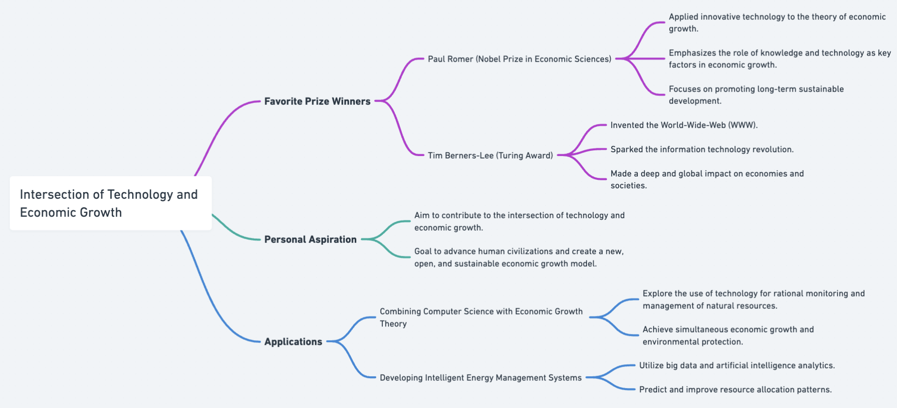
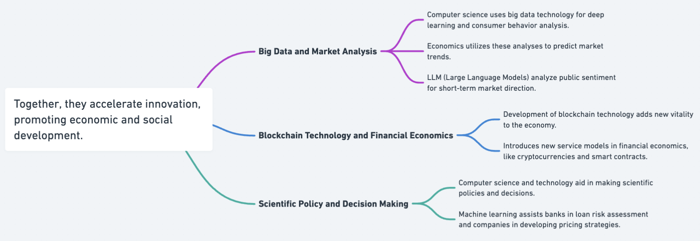
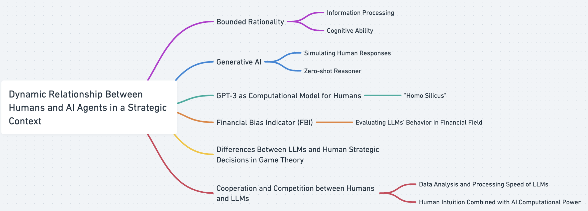

# Questions

### Qustion 1
**When computer science meets economics**: Who do you truly want to become? Pick one of your favorite Nobel Prize winners [(https://www.nobelprize.org/)](https://www.nobelprize.org/) and Turing Award winners [(https://amturing.acm.org/)](https://amturing.acm.org/). How do you want to contribute to the intersection of the two north stars to advance human civilizations?
### Question 2
**CS&Econ for a Better Future**: How do you perceive the synergy between computer science and economics as a catalyst for steering innovation toward a brighter future? Please present a foundational assertion, followed by multiple specific instances that support your claim, including a reference to a topic discussed at the colloquium on Friday, March 22.
### Question 3
**Beyond CS & Econ**: How are aspects of human nature, like bounded rationality, and pioneering technologies, such as generative AI, reshaping the dynamics between humans and AI agents in strategic contexts? Additionally, how might this interplay be perceived and conceptualized distinctively from current models? Address this inquiry by drawing upon the literature covered in our lectures and supplementary scholarly works, ensuring to include in-text citations and a comprehensive bibliography.

# Answers

### Question 1
For my favorite Nobel Prize winner and Turing Prize winner, I'd like to choose Paul Romer, who won the prize of economic science Nobel Prize, and Time Berners-Lee, who won the Turing award. Paul won the prize because he applied innovative technology to the theory of economic growth. His research emphasizes why knowledge and technology are the key factors affecting economic growth, especially in promoting long-term sustainable development. Tim won the prize because he invented World-Wide-Web (WWW). His innovation started the information technology revolution and affected economies and societies deeply and globally. I'd like to use advanced information technology to contribute to the intersection of the two north stars to advance human civilizations and create a new open and sustainable economic growth model. For example, I can combine advanced technology in computer science with the growth theory of economics to explore how to use technology to rationally monitor and manage natural resources to achieve economic growth and environmental protection simultaneously. For example, we can develop intelligent energy management systems using big data and artificial intelligence analytics to predict good resource allocation patterns. (Check Figure 1 for mindmap)

Figure 1: Mindmap for Question 1
### Question 2
Developments in computer science provided data processing, intelligent algorithms, and efficient computing power. In the meantime, economics provided an understanding of market needs, resource allocation, and value maximization. Together, they can accelerate innovation and promote economic and social development. The following examples support this statement: 1. According to innovation Notes by Satya (Greg, 2024), computer science can conduct deep learning and consumer behavior analysis through big data technology. Economics can use these analyses to predict market trends. In addition, LLM can also be used to analyze public sentiment and judge the overall market's direction in the short term. This combination can optimize product design, accurately locate the market, and increase the competitiveness of enterprises. 2. In the lecture on March 22, we can also learn that the development of blockchain technology in computer science will also inject new vitality into the development of the economy (Ming, 2024). This technology brings new service models to financial economics, such as cryptocurrencies and smart contracts, which can optimize the transaction process and improve the efficiency and transparency of financial trading systems. 3. Computer science and technology can help enterprises and governments make more scientific policies and decisions. For example, machine learning can help banks assess loan risk and help companies develop pricing strategies. (Check Figure 2 for mindmap)

Figure 2: Mindmap for Question 2
### Question 3
Some aspects of human nature, such as bounded rationality, and groundbreaking technologies, such as generative AI, reshape the dynamic relationship between humans and AI agents in a strategic context. In a strategic context, limited rationality leads to human decision-making restricted by information processing and cognitive ability. However, LLMs can simulate and predict human responses in different contexts. According to Kojima (2022), generative AI has demonstrated the ability to operate as a rational "zero-shot reasoner" in a strategic context. GPT-3's training and design can be viewed as an implicit computational model for humans, the "homo silicus" (Horton, 2023). However, according to Zhou et al. (2024), although these models absorb a wide range of knowledge in financial analysis, they will still show superficial understandings when explaining complex market trends. Therefore, Zhou et al. (2024) proposed the Financial Bias Indicator (FBI) to critically evaluate the rational behavior of LLMs in the financial field, which is also a kind of dynamics between humans and AI agents in the current era. In the analysis of Fan et al. (2023), the significant differences between LLMs' behavior and human strategic decisions in game theory also prompt us to reconsider the way AI is used in strategic decision-making.

Moreover, unlike existing models, such dynamics may be uniquely perceived and conceptualized, which can be a relationship of cooperation and competition. In this interaction, LLMs can provide data analysis and processing speed that humans cannot, while humans provide understanding and processing power for contexts. It combines human intuition with the computational power of AI, potentially producing solutions that are beyond the capabilities of humans or AI alone. (Check Figure 3 for mindmap)

Figure 3: Mindmap for Question 3
## Bibliography
Fan, Caoyun, Jindou Chen, Yaohui Jin, and Hao He. "Can Large Language Models Serve as Rational Players in Game Theory? A Systematic Analysis." arXiv.org, December 9, 2023. https://arxiv.org/abs/2312.05488.

Horton, John J. "Large Language Models as Simulated Economic Agents: What Can We Learn From Homo Silicus?" arXiv.org, January 18, 2023. https://arxiv.org/abs/2301.07543.

Kojima, Takeshi, Shixiang Gu, Machel Reid, Yutaka Matsuo, and Yusuke Iwasawa. "Large Language Models Are Zero-Shot Reasoners," December 6, 2022. https://proceedings.neurips.cc/paper_files/paper/2022/hash/8bb0d291acd4acf06ef112099c16f326-Abstract-Conference.html.

Sun, G. (2024). [United in Innovation: Pioneering Technologies for a Better Tomorrow]. University Colloquium Committee (UCC) at Duke Kunshan University (DKU), Co-hosted by Data Science Research Center (DSRC), DKU Finance and Computer Science Club, and Microsoft Asia Pacific Research and Development (R&D) Group, Duke Kunshan University.

Wu, M. (2024). [United in Innovation: Pioneering Technologies for a Better Tomorrow]. University Colloquium Committee (UCC) at Duke Kunshan University (DKU), Co-hosted by Data Science Research Center (DSRC), DKU Finance and Computer Science Club, and Microsoft Asia Pacific Research and Development (R&D) Group, Duke Kunshan University.

Zhou, Yuhang, Yuchen Ni, Xiang Liu, Jian Zhang, Sen Liu, Guangnan Ye, and Hongfeng Chai. "Are Large Language Models Rational Investors?" arXiv.org, February 20, 2024. https://arxiv.org/abs/2402.12713.
